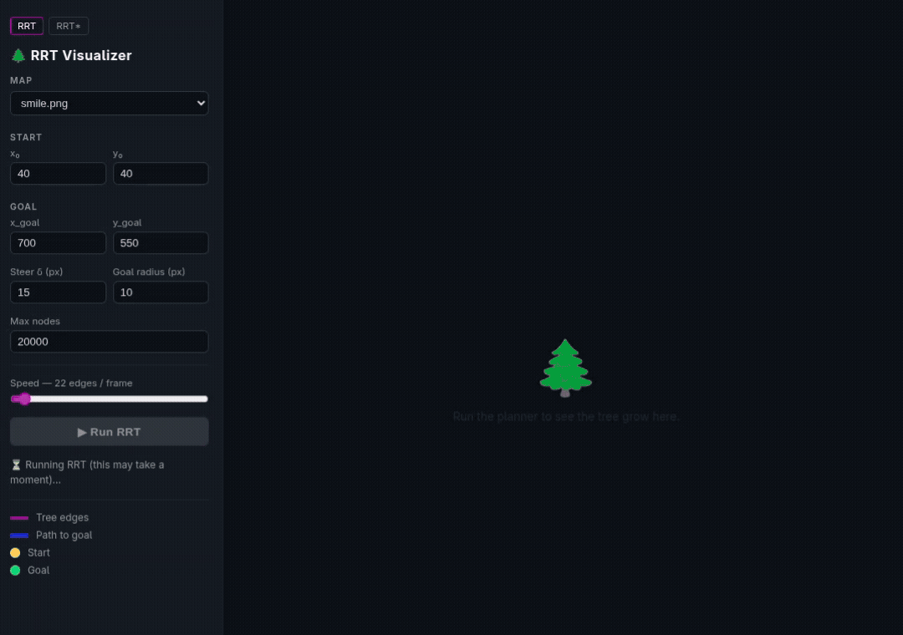

# rrt-motion-planner

Implementations of RRT and RRT* sampling-based motion planners in Python, with both a desktop (pyglet) and a browser-based (PixiJS) visualization.

## Quick test with browser visualizer using docker

```bash
# 1 — Build images in order (webvis layer depends on the base image)
docker compose -f docker/docker-compose.yml build rrt-planner
docker compose -f docker/docker-compose.yml build rrt-webvis

# 2a — Run the RRT web visualizer, then open http://localhost:8000
docker compose -f docker/docker-compose.yml --profile webvis up

# 2b — Run the RRT* web visualizer, then open http://localhost:8000/rrtstar.html
docker compose -f docker/docker-compose.yml --profile webvis-rrtstar up

# 2c — Run the differential-drive planner instead (opens a desktop window, not the browser)
docker compose -f docker/docker-compose.yml --profile differential-drive up
```

Next, open **http://localhost:8000** in your browser to run the RRT visualizer, or **http://localhost:8000/rrtstar.html** for RRT*. Select a map, set the parameters, adjust the animation speed, and click **Run**. Step 2c instead opens a desktop window directly, planning and animating a `DifferentialDriveRobot` — see [Running the differential-drive planner](#running-the-differential-drive-planner) below.

---

## Quick view of the web visualizer



A full video of the Desktop visualizer is available [here](https://youtu.be/lUQy1XxTALI).

---

## Setup

Create and activate a virtual environment, then install all dependencies:

```bash
virtualenv my_venv
source my_venv/bin/activate
pip install -r python-scripts/requirements.txt
```

---

## Running the desktop visualizer

```bash
cd python-scripts
python3 main.py <map> <steer_delta> <goal_radius> <max_nodes> <x0> <y0> <xg> <yg> [max_planning_time] [gamma_rrt] [eta_rrt] [near_radius]
```

| Argument | Description |
|---|---|
| `map` | PNG map file in `python-scripts/` |
| `steer_delta` | Steer step size in pixels |
| `goal_radius` | Goal ball radius in pixels |
| `max_nodes` | Maximum tree nodes |
| `x0 y0` | Start coordinates |
| `xg yg` | Goal coordinates |
| `max_planning_time` | Optional maximum planning time in seconds. Omit for no time limit. |
| `gamma_rrt` | Optional RRT* nearest-neighbor gain. Defaults to `1000`. |
| `eta_rrt` | Optional RRT* nearest-neighbor radius cap. Defaults to `20`. |
| `near_radius` | Optional RRT* `nearest_neighbor_radius` — accepted for backward compatibility but not actually used by the algorithm. Defaults to `20`. |

Example commands:

```bash
python3 main.py smile.png      15 10  50000  40  40  700 550
python3 main.py simplemaze.png 15 10 100000  40  40  825 825
python3 main.py maze1.png      15 10 100000  40  40  750 750
```

A window with the loaded map opens first — close it to continue. A black pyglet window will open. Press `s` to start planning with RRT. Press `Esc` to close and open the RRT* window. Press `s` again to start RRT*.

---

## Running the differential-drive planner

`main_differential_drive.py` plans for a `DifferentialDriveRobot`, whose state is `[x, y, theta]` instead of just `[x, y]`. Rather than steering directly towards a sampled configuration, each RRT/RRT* extension applies a randomly sampled `[linear_velocity, angular_velocity]` control to the nearest tree node for one simulated step (`DifferentialDriveRandomControlSteering`), following the kinodynamic RRT formulation in S. LaValle's *Planning Algorithms* (Section 5.3.1); the sampled configuration is only used to pick which existing tree node to extend from.

```bash
cd python-scripts
python3 main_differential_drive.py [map] [goal_radius] [max_nodes] [x0] [y0] [xg] [yg] [max_planning_time] [robot_radius] [linear_velocity_max] [angular_velocity_max] [sampling_time] [fps]
```

| Argument | Description |
|---|---|
| `map` | PNG map file in `python-scripts/`. Defaults to `smile.png`. |
| `goal_radius` | Goal ball radius in pixels. Defaults to `20`. |
| `max_nodes` | Maximum tree nodes. Defaults to `20000`. |
| `x0 y0` | Start `(x, y)` coordinates. Defaults to `30 30`. |
| `xg yg` | Goal `(x, y)` coordinates. Defaults to `30 460`. |
| `max_planning_time` | Optional maximum planning time in seconds. Defaults to `20`. |
| `robot_radius` | Circular footprint radius, used both for collision checking and to draw the robot. Defaults to `8`. |
| `linear_velocity_max` | Upper bound of the sampled linear velocity (lower bound is always `0`). Defaults to `20`. |
| `angular_velocity_max` | Upper bound of the sampled angular velocity, symmetric around `0`. Defaults to `1`. |
| `sampling_time` | Duration, in seconds, simulated per sampled control. Defaults to `1.0`. |
| `fps` | States of the final path drawn per second when animating the robot. Defaults to `10`. |

Every argument is optional and keeps its default when left out. Run `python3 main_differential_drive.py --help` to see the usage line. RRT plans fully first; its tree and path are drawn, then a differential-drive robot — a circle with a heading line and a perpendicular axle line, via `PlanDrawer.animate_differential_drive_path()` — animates along the found path at `fps` states per second. Press `Esc` in that window to close it and start planning RRT*, whose finished tree and path are drawn and animated the same way in a second window (press `Esc` there to close it).

`sampling_time` also becomes `steer_delta` internally, which `DifferentialDriveSteering` uses directly as the distance (in pixels) driven per RRT/RRT* extension step. The default of `1.0` therefore advances only about a pixel per iteration — far too slow to converge across a map hundreds of pixels wide. Use a larger value such as `20.0` in practice.

Example command with every argument specified (matches the built-in defaults, except `sampling_time`, bumped to `20.0` per the note above):

```bash
python3 main_differential_drive.py smile.png 20 20000 30 30 30 460 20 8 20 1 20.0 10
```

---

## Running the web visualizer

The web visualizer runs in a browser using PixiJS. A single server serves both algorithms.

```bash
# From the project root
uvicorn webvis.server:app --host 0.0.0.0 --port 8000 --reload
```

**RRT** — open **http://localhost:8000**. Select a map, set the parameters, adjust the animation speed, and click **Run RRT**. The full tree is computed first, then animated edge-by-edge. Planning runs `plan()` under the hood, which stops at the first solution or when `num_nodes` or the optional `max_planning_time` (in seconds) is reached — whichever happens first.

**RRT*** — open **http://localhost:8000/rrtstar.html**. Planning and drawing are interleaved: the tree is redrawn from scratch on every update because rewiring changes parent pointers. Use the **Steps per update** slider to balance responsiveness against rendering cost, and click **Stop** at any time.

---

## Running with Docker

See [`docker/README.md`](docker/README.md) for full instructions. Quick start:

```bash
# Allow the containers to connect to the host X server (desktop only)
xhost +local:docker

# Build images in order (webvis layer depends on the base)
docker compose -f docker/docker-compose.yml build rrt-planner
docker compose -f docker/docker-compose.yml build rrt-webvis

# Desktop visualizer
docker compose -f docker/docker-compose.yml --profile desktop up

# Plan-then-draw mode
docker compose -f docker/docker-compose.yml --profile plan-then-draw up

# Differential-drive planner
docker compose -f docker/docker-compose.yml --profile differential-drive up

# Web visualizer (RRT) — open http://localhost:8000
docker compose -f docker/docker-compose.yml --profile webvis up

# Web visualizer (RRT*) — open http://localhost:8000/rrtstar.html
docker compose -f docker/docker-compose.yml --profile webvis-rrtstar up
```

---

## Adding new maps

The map must be a black-and-white PNG with obstacles in black.
