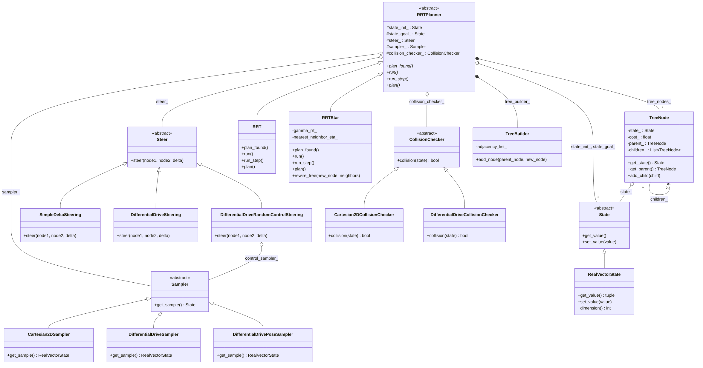
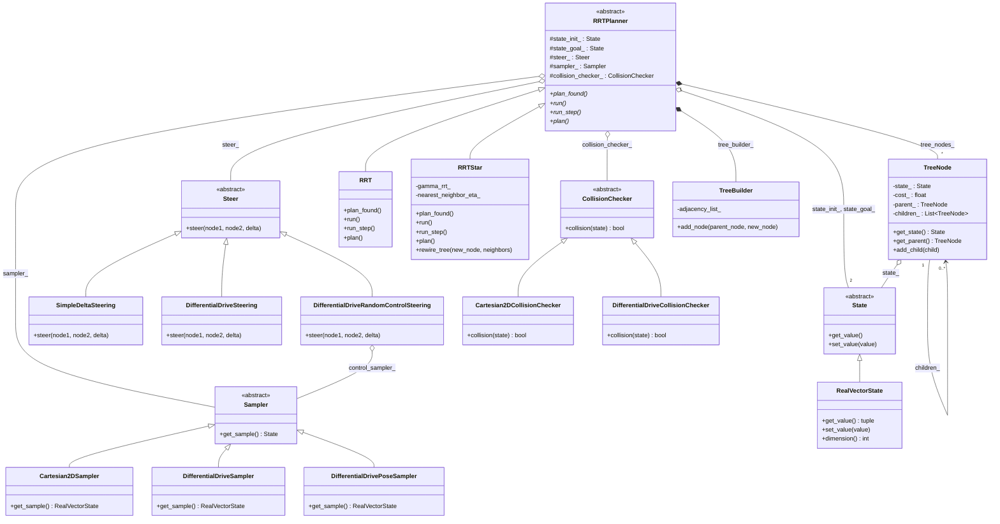

# UML Class Diagram — RRT / RRT* Planners

This diagram documents the abstract/concrete (Strategy) design used by
[`RRTPlanner.py`](../python-scripts/RRTPlanner.py),
[`RRT.py`](../python-scripts/RRT.py) and
[`RRTStar.py`](../python-scripts/RRTStar.py), together with the abstract
collaborator classes they depend on (`State`, `Steer`, `Sampler`,
`CollisionChecker`) and the concrete implementations of those collaborators
found in the repository.

Mermaid was chosen over Graphviz/Pyreverse because it lets the relationships
be curated by hand (only class names and key abstract methods, per the
project's "less abstraction, more clarity" style) instead of auto-dumping
every method/attribute, and it renders natively in GitHub and most Markdown
previewers without extra tooling. A pre-rendered PNG is also kept at
[`uml-class-diagram.png`](uml-class-diagram.png) for viewers without Mermaid
support:

## Notes on the design

- **`RRTPlanner`** is an `ABC` (template-method style base class) that
  implements the shared tree/graph bookkeeping (`nearest_node`, `path`,
  `cost_to_node`, node/edge storage, planning-time and node-budget checks)
  and declares four abstract hooks — `plan_found()`, `run()`, `run_step()`,
  `plan()` — that `RRT` and `RRTStar` must implement with their own
  expansion/rewiring logic.
- **`State`, `Steer`, `Sampler`, `CollisionChecker`** are Strategy-pattern
  interfaces injected into `RRTPlanner` via its constructor, so a planner is
  agnostic to the concrete configuration space (`RealVectorState`,
  differential-drive pose, etc.), steering method, sampling distribution, and
  collision representation.
- **`DifferentialDriveRandomControlSteering`** is itself a `Steer`
  implementation that internally composes a `Sampler` (to draw random control
  inputs), showing the same Strategy pieces being reused across layers.
- **`TreeNode`** holds a `State` plus parent/children pointers, forming the
  parent-pointer tree used to reconstruct paths and (in `RRTStar`) to
  propagate cost updates during rewiring. **`TreeBuilder`** is a separate,
  simpler adjacency-list structure kept in sync alongside it.
